# Census Tract Control Analysis
**Notebook:** `notebooks/tasks/06_census_control_analysis.ipynb`

---

## Overview

This analysis compares how assessor-recorded property characteristics change over time for the **UDU sample** (442 parcels flagged as having unpermitted dwelling units) against a **control population** drawn from the same census tracts. The central question is whether changes observed in UDU parcels — in building size, unit count, and use type — are systematically different from what is happening in the broader residential market within those same neighborhoods, particularly before and after **2017** (the key policy year for LA's ADU permitting reforms).

The control group is restricted to **multi-family parcels** (double/duplex, three-unit, four-unit, and five-or-more-unit) in the 302 census tracts that contain at least one UDU, providing a like-for-like neighborhood baseline.

---

## Sample Construction

### UDU Tracts

302 census tracts were identified as containing at least one UDU parcel using a spatial join between UDU geocoordinates and 2024 Census block geometries dissolved to the tract level.

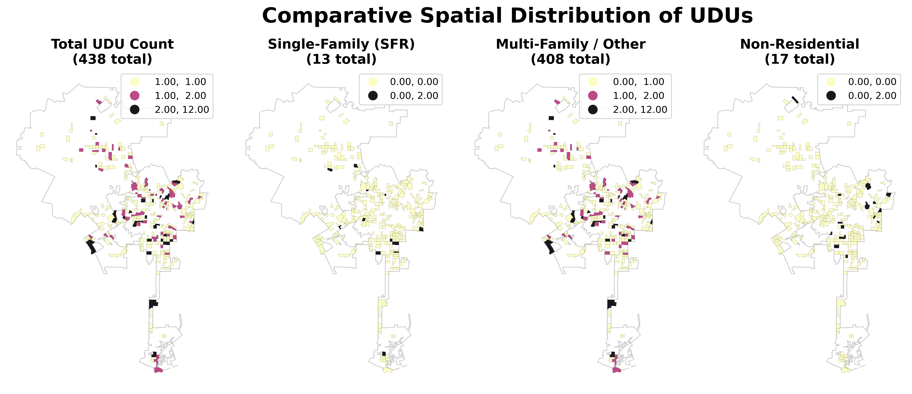

*Each dot marks a UDU parcel. The 302 highlighted tracts form the geographic boundary within which the control population is drawn.*

### Control Population

For each of the 302 UDU tracts, all non-UDU parcels were loaded from the assessor roll. Control parcels are filtered to those whose **first recorded use type** falls within the multi-family residential category:

- Double, Duplex, or Two Units
- Three Units (Any Combination)
- Four Units (Any Combination)
- Five or More Units or Apartments (Any Combination)

This ensures the control population shares a similar residential character to the UDU parcels and avoids contamination from single-family or commercial baseline compositions.

---

## Change Detection

Year-over-year changes are detected across three assessor fields:

| Feature | Mode | Classification |
|---|---|---|
| `SQFTmain` | Numeric difference | Decrease / <100 sqft / 100–500 sqft / 500–1200 sqft / >1200 sqft |
| `Units` | Numeric difference | Unit Loss / Correction / +1 Unit / +2–4 Units / 5+ Units |
| `UseCodeDescChar2` | Transition type | Residential Densification / De-densification / Residential to Commercial / Commercial to Residential / Commercial to Commercial / Hospitality Development / Other Use Change |

A change is recorded whenever the assessor value for a given AIN differs from the prior roll year. Changes are expressed as a **share of total AINs** in each tract (%) to normalize for tract size.

---

## Annual Revision Rates

### UDU Sample Baseline

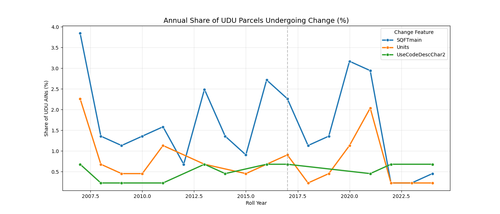

*Annual share of UDU parcels with any year-over-year change in building size, unit count, or use type. A vertical line marks 2017. Use-type changes are relatively stable; unit and sqft revisions show more variability.*

### Single Control Tract (Exploratory)

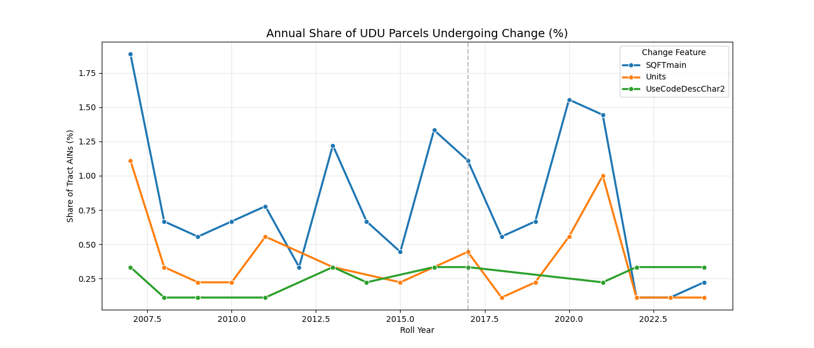

*Same metric computed for a single UDU-containing tract (exploratory, before the full tract loop). Confirms that control parcels also show periodic revisions, motivating the need for a multi-tract CI comparison.*

---

## UDU vs. Control: Main Comparison

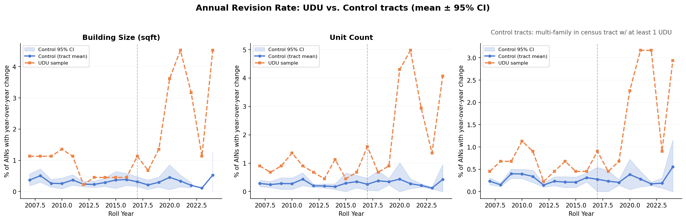

*Annual revision rate (% of AINs with a year-over-year change) for three features. Blue band = mean ± 95% CI across the UDU-like tracts; orange dashed = UDU sample. The 2017 line marks the ADU policy shift.*

The control CI is computed via a two-step aggregation: change rates are summed across change-type categories within each tract × year, then the mean and standard error are taken across tracts. This avoids inflating the CI by treating each category as an independent observation.

### 2017 Snapshot: Use-type and Size Composition

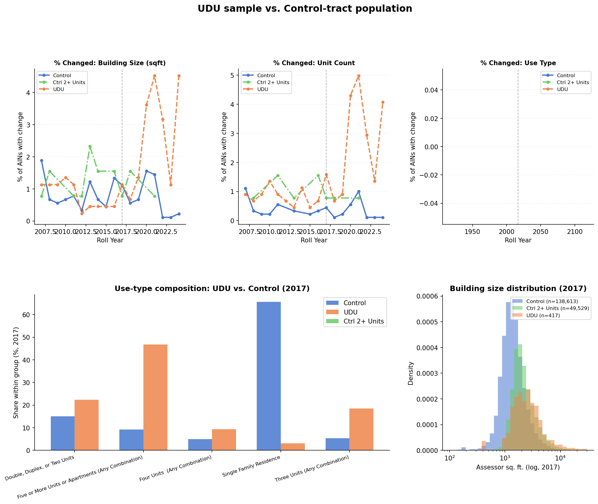

*Top row: annual revision rates for each feature (UDU, Control, and a 2+ unit sub-group). Bottom left: use-type composition in 2017 for UDU vs control parcels. Bottom right: building size (log scale) distribution in 2017. UDU parcels skew toward single-family use types and smaller footprints than the multi-family control.*

---

## Subclassification: Building Size (SQFTmain)

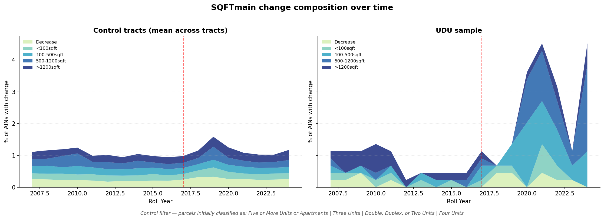

*Stacked area plots showing the composition of SQFTmain changes by size category over time. Left: control tract mean; right: UDU sample. Large additions (>1200 sqft) are more prominent in the UDU sample, particularly after 2017.*

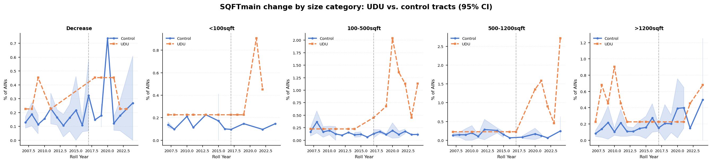

*One panel per change category. Blue band = control tract 95% CI; orange dashed = UDU sample. The UDU sample consistently sits above the control mean for large sqft additions (>1200 sqft), and shows a more pronounced post-2017 shift.*

---

## Subclassification: Unit Count

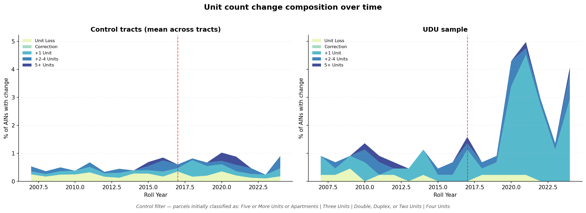

*Stacked area plots for unit count changes. The UDU sample shows a higher share of +1 unit additions relative to the multi-family control, consistent with informal unit conversion rather than formal redevelopment.*

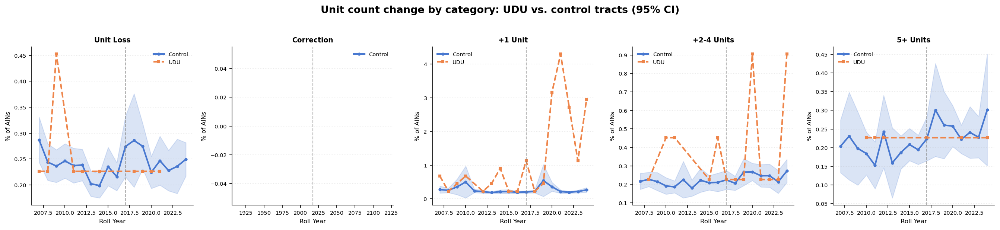

*Per-category panels for unit changes. The "+1 Unit" category in the UDU sample diverges from the control notably after 2017, suggesting that some UDU parcels are being formally re-recorded with an additional unit following the ADU reforms.*

---

## Subclassification: Use-Type Conversion

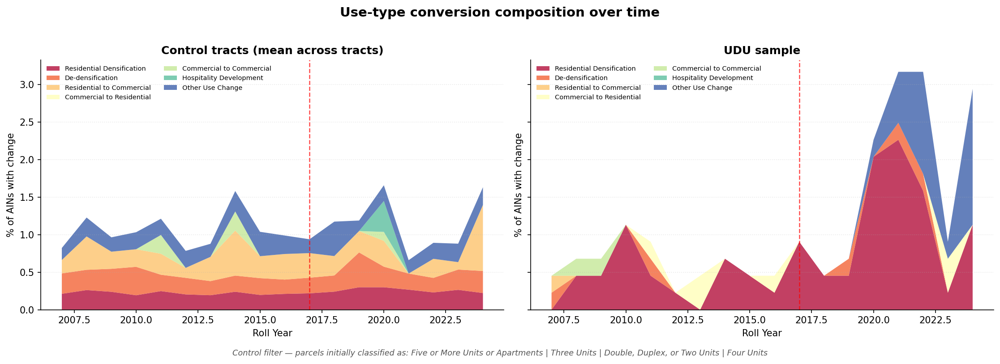

*Stacked area of use-type transition categories over time. Both UDU and control show Residential Densification as the dominant transition type, but the UDU sample has a visible Commercial to Residential component absent from the control.*

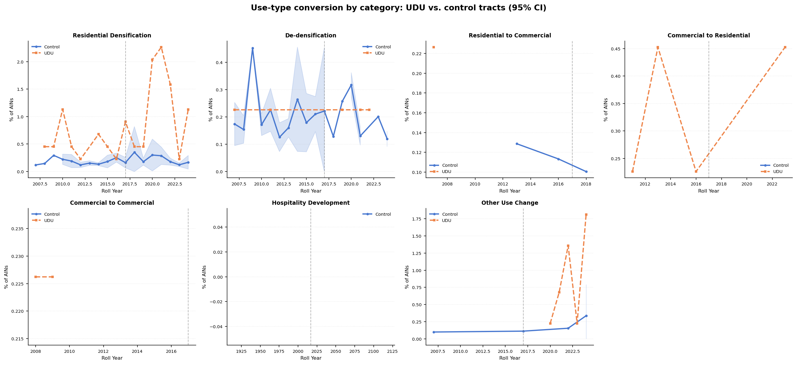

*Per-category panels for use-type conversions. All seven transition types are shown for both groups. The "Commercial to Residential" panel shows UDU activity with near-zero control representation, indicating this transition pattern is specific to the UDU sample and not a general neighborhood trend.*

---

## Notes

- Control parcels are filtered by **first-year use type**, so the composition is fixed at baseline and does not shift as parcels are reclassified over time.
- The 2017 threshold corresponds to California's statewide ADU permitting reforms (AB 2299 / SB 1069), which substantially lowered barriers to legalizing existing informal units in LA.
